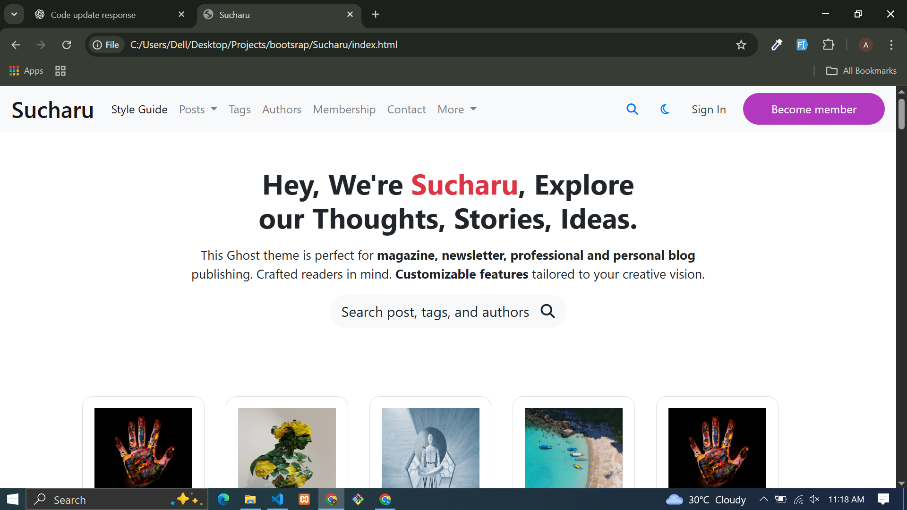

# 📰 Sucharu Bootstrap Template  

This is a **Blog & Magazine Website Template** built with **Bootstrap 4.6**.  
It includes modern sections like editor’s choice, blog, testimonials, articles, and footer.  

---

## 📸 Preview  
  

---

## 🚀 Features  
- Blog & Magazine style design  
- Bootstrap 4.6 Grid & Components  
- Editor’s Choice Section  
- Blog Cards & Article Layouts  
- Testimonial Section  
- Newsletter Subscription  
- Footer with links & social icons  

---

## 🛠️ Tech Stack  
- **HTML5**  
- **CSS3**  
- **Bootstrap 4.6**  
- **Font Awesome 6**  

---

## 📂 Project Structure  
sucharu-bootstrap-template/
│── assets/
│ ├── css/style.css
│ ├── images/
│       ├── sucharu/
│── index.html
│── README.md

---

## 🔗 Live Demo  
👉 [Click Here](https://attiq-ur-rehman4855.github.io/sucharu-bootstrap-template/)  

---

## 👨‍💻 Author  
- Attiq Ur Rehman  
  [GitHub Profile](https://github.com/attiq-ur-rehman4855)  
